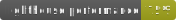

# NgStart




[](http://commitizen.github.io/cz-cli/)

Angular progressive web app starter.

- changes : [CHANGELOG.md](./CHANGELOG.md)
- hosted results : [English](https://miaborde.github.io/ng-start/en-US) - [French](https://miaborde.github.io/ng-start/fr)

## How to use it

### Run this project on your machine

> You need [Node.js](https://nodejs.org) or [Docker](https://docs.docker.com/get-docker/) or [Podman](https://podman.io/getting-started/) to run this project

```bash
# get this repo
git clone https://github.com/mIaborde/ng-start
# move in
cd ng-start
```

```bash
# run it with node.js
npm start
```

```bash
# run it with docker or podman :
docker build -t ng-start .
docker run --name ng-start -d -p 80:80 -p 443:443 ng-start
# or
npm run container
```

> During build you can see `npm WARN optional SKIPPING OPTIONAL DEPENDENCY: fsevents`, it's normal, `fsevents` is just for OSX systems, not required on Linux.

### Documentation

```bash
# build documentation website and open it
npm run doc
```

### Internationalization

This project is available in two languages, it implements `@angular/localize`. If you run it in container Nginx server redirects users to the correct version of the app, according to their browser language.

```bash
# update locale
npm run locale
# run app in english
npm run start
# run app in french
npm run start:fr
```

**When you update locale you automatically perform the following actions :**

- update **messages.xlf** with angular built-in internationalization module (see [Angular i18n](https://angular.io/guide/i18n))
- merge **messages.xlf** and **messages.fr.xlf** using [ngx-i18nsupport-lib](https://github.com/martinroob/ngx-i18nsupport-lib) thanks to [martinroob](https://github.com/martinroob) for sharing his awesome tools !

**Then you have to :**

- translate `<source>` in `<target>` in **messages.fr.xlf**

### Make your commits

```bash
# add your changes
git add .
# commit with cli-tool
npm run gc
# push changes
git push
# if you perform a release remember to keep tags
git push --follow-tags
```

### Create a release

```bash
# perform release modifications, and commit all staged changes
npm run release
```

**When you create a release you automatically perform the following actions :**

- increment version number in package.json (respect [semantic versioning](https://semver.g))
- add a git tag
- build Github Pages demo
- update CHANGELOG.md with _fix:_ and _feat:_ commit label

**Then you have to :**

- push release : `git push --follow-tags`
- (optional) update lighthouse badges with :

```bash
npm run lighthouse && git add ./docs
git commit -m 'docs(lighthouse): README.md badges updated'
git push
```

### Performances monitoring

```bash
# analyze your angular webpack bundle
npm run analyze
# check lighthouse score
open https://web.dev/measure
# check hosted app lighthouse score, update README.md badges
npm run lighthouse
```

### VSCode Chrome debugger

You can easily launch this app in debug mode, you need this [extension](https://marketplace.visualstudio.com/items?itemName=msjsdiag.debugger-for-chrome), and Google Chrome. Follow this [guide](https://github.com/microsoft/vscode-recipes/tree/master/Angular-CLI) to know more. Angular specific settings are already done in **.vscode** folder.

> **Use Chromium instead of Chrome on Linux distros**
>
> create an alias with this command : `sudo ln -s /usr/bin/chromium /usr/bin/google-chrome`, path can be different on your distro !
