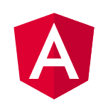

<div align="center">




[](http://commitizen.github.io/cz-cli/)
[](https://github.com/conventional-changelog/standard-version)


[demo (en-US)](https://miaborde.github.io/ng-start/en-US) - [demo (fr)](https://miaborde.github.io/ng-start/fr) - [changelog](./CHANGELOG.md)

</div>

- [Run it in development](#run-it-in-development)
  - [Local Node.js](#local-nodejs)
  - [VSCode Chrome debugger](#vscode-chrome-debugger)
- [Run it in production](#run-it-in-production)
  - [Containerized](#containerized)
  - [Local Node.js](#local-nodejs-1)
- [Contribute](#contribute)
  - [Git flow](#git-flow)
  - [Create a release](#create-a-release)
  - [Documentation](#documentation)
  - [Internationalization](#internationalization)
  - [Performances monitoring](#performances-monitoring)
- [Make it yours](#make-it-yours)

## Run it in development

### Local Node.js

You can run this project in watch/debug mode in local dev environment, to do so you need [Node.js (14.15.4)](https://nodejs.org).

**Example :**

```bash
# install dependencies
npm i
# run in development mode, default language
npm run start
# run in development mode, in french
npm run start:fr
```

### VSCode Chrome debugger

If you use [Visual Studio Code](https://code.visualstudio.com/) You can easily launch this app in debug mode, you need this [extension](https://marketplace.visualstudio.com/items?itemName=msjsdiag.debugger-for-chrome) (automatically added if you accept recommended extensions), and Google Chrome. Follow this [guide](https://github.com/microsoft/vscode-recipes/tree/master/Angular-CLI) to know more. All settings are already done in **.vscode** folder.

> **Use Chromium instead of Chrome on Linux distros**
>
> create an alias with this command : `sudo ln -s /usr/bin/chromium /usr/bin/google-chrome`, path can be different on your distro !

## Run it in production

### Containerized

You can run this project in production mode in container, to do so you just need [Docker](https://docs.docker.com/get-docker/).

**Example :**

```bash
# with docker only
docker build -t ng-start .
docker run --name ng-start -d -p 80:80 -p 443:443 ng-start

# if you have Docker AND Node.js installed you can use short commands :
npm run docker:build:prod
npm run docker:prod
```

> **Note:** If your host machine is not running on Linux you maybe should not have a **node_modules** folder before starting to build containers, some packages do not work the same on different OS.

### Local Node.js

You can build this project and serve it in production mode directly on your development environment, to do so you need [Node.js (14.15.4)](https://nodejs.org).

**Example :**

```bash
# install dependencies
npm i
# build in production mode (contains all languages)
npm run build:prod
# serve built project with http-server package (or whatever your want)
npx http-server ./dist/ng-start/
```

## Contribute

### Git flow

This project respects [Conventional commits](https://github.com/angular/angular/blob/master/CONTRIBUTING.md#commit), a Git commit convention made by the Angular team. Basically, every pull request should end up with one commit and a standardized commit message.

To easily respect this convention a tool is provided: [Commitizen-cli](https://github.com/commitizen/cz-cli).

**Example :**

```bash
# add your changes
git add .
# commit with commitizen-cli
npm run cz
# push changes
git push

# if your commit fail you can perform changes and retry with previous message
npm run cz -- --retry
```

### Create a release

This project respects [Semantic Versioning specification](https://semver.org). This allows the automatic generation of [CHANGELOG.md](./CHANGELOG.md) file.

To easily respect this specification a tool is provided: [Standard-version](https://github.com/conventional-changelog/standard-version).

> **Note:** commit or stash any changes before create a release.

**Example :**

```bash
# add your changes
git add .

# use standard-version, commit all staged changes
npm run release
# OR
npm run release:alpha

# push your changes, keep version tag
git push --follow-tags

# (optional) update lighthouse badges with :
npm run lighthouse && git add ./docs
git commit -m 'docs(lighthouse): readme lighthouse badges updated'
```

> **When you perform a release you automatically perform the following actions :**
>
> - increment version number in package.json (uses the `fix:` and `feat:` tags to establish the semantic versioning)
> - add a git tag
> - build Github Pages demo
> - update **CHANGELOG.md**

### Documentation

- **Code documentation:** this project use [Compodoc](https://compodoc.app/guides/getting-started.html) a documentation tool for Angular & Nestjs applications. It generates a static documentation of your application.

**Example :**

```bash
# code documentation: build doc website and open it
npm run doc
```

### Internationalization

This project is available in multiple languages, it implements [Angular internationalization](https://angular.io/guide/i18n). If you run it in containerized mode Nginx server redirects users to the correct version of the app, according to their browser language.

When you add/modify/delete a localized string in project you have to **update locale** to generate new **messages.xlf** file and translate the new string in **messages.{fr,others}.xlf** file(s).

**Example :**

```bash
# update locale
npm run locale
```

> When you update locale you automatically perform the following actions :
>
> - update **messages.xlf** with angular built-in internationalization module
> - merge **messages.xlf** and **messages.fr.xlf** using [ngx-i18nsupport-lib](https://github.com/martinroob/ngx-i18nsupport-lib)

### Performances monitoring

```bash
# analyze your angular webpack bundle
npm run analyze

# check lighthouse score
open https://web.dev/measure
```

## Make it yours

- clic on **Use this template** from [this Github repo](https://github.com/mIaborde/ng-start) and clone your project
- open your project with your favorite IDE, and replace ALL `ng-start` occurrence in folder tree with your project name
- set **package.json** version to `0.0.0`
- delete **CHANGELOG.md** and **.git**
- you're good to go :)
